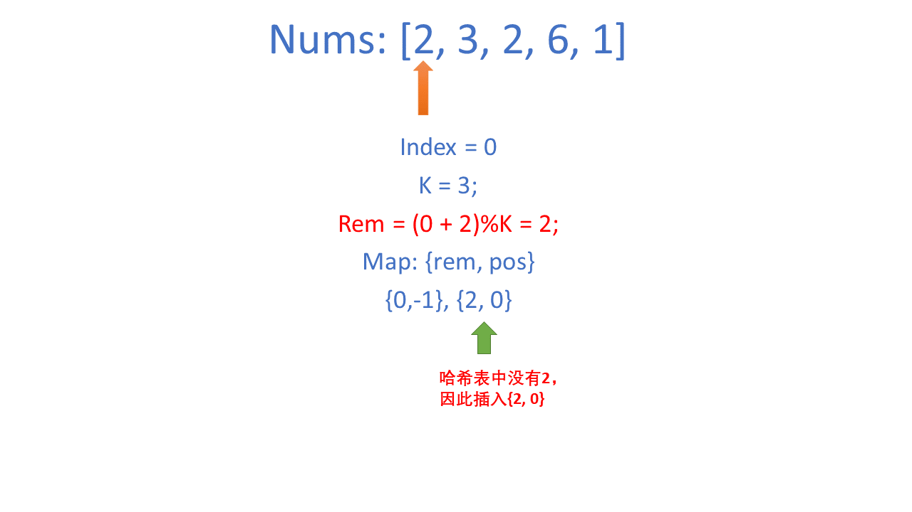
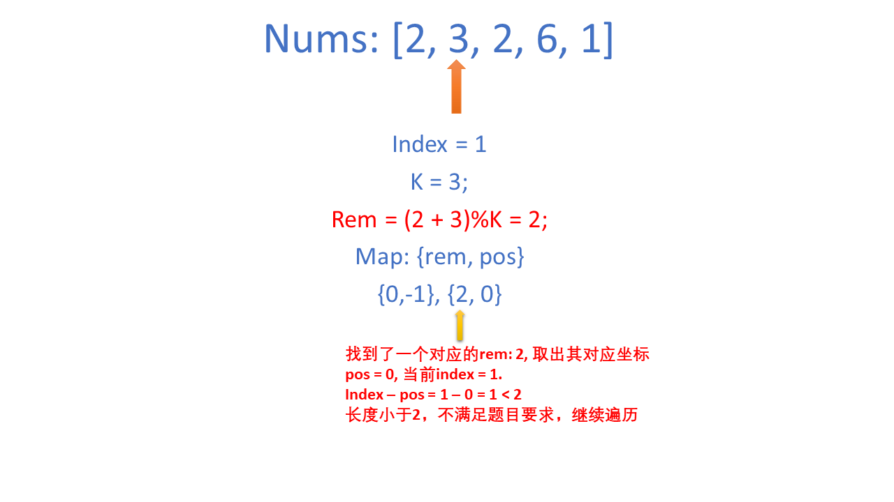
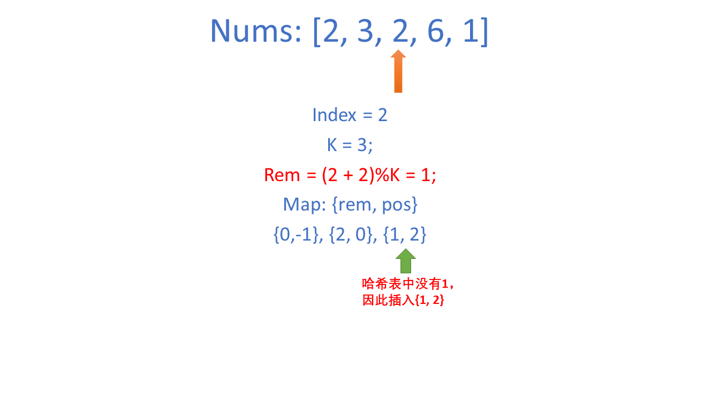
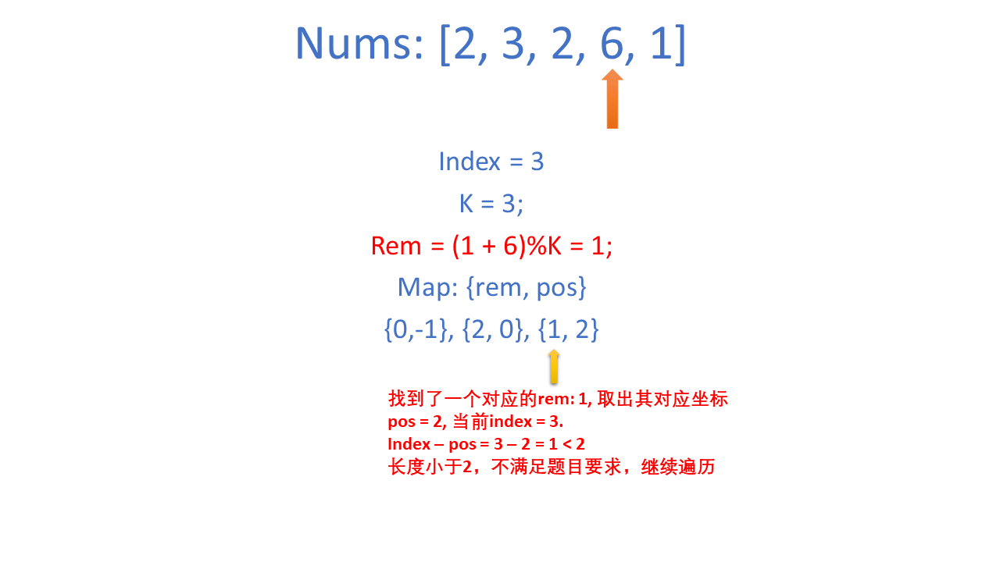
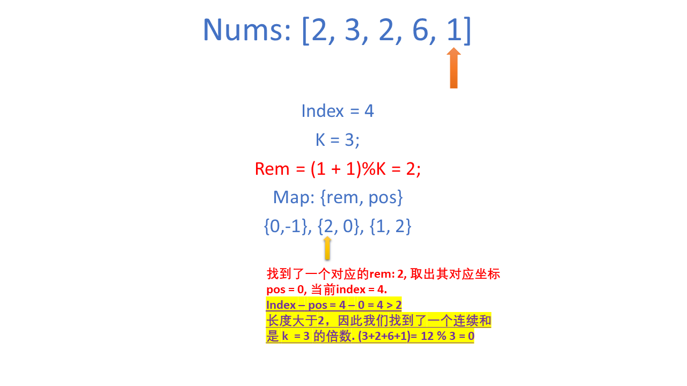

# [523. 连续的子数组和](https://leetcode-cn.com/problems/continuous-subarray-sum/)

给你一个整数数组 `nums` 和一个整数 `k` ，编写一个函数来判断该数组是否含有同时满足下述条件的连续子数组：

- 子数组大小 **至少为 2** ，且
- 子数组元素总和为 `k` 的倍数。

如果存在，返回 `true` ；否则，返回 `false` 。

如果存在一个整数 `n` ，令整数 `x` 符合 `x = n * k` ，则称 `x` 是 `k` 的一个倍数。

 

**示例 1：**

```
输入：nums = [23,2,4,6,7], k = 6
输出：true
解释：[2,4] 是一个大小为 2 的子数组，并且和为 6 。
```

**示例 2：**

```
输入：nums = [23,2,6,4,7], k = 6
输出：true
解释：[23, 2, 6, 4, 7] 是大小为 5 的子数组，并且和为 42 。 
42 是 6 的倍数，因为 42 = 7 * 6 且 7 是一个整数。
```

**示例 3：**

```
输入：nums = [23,2,6,4,7], k = 13
输出：false
```

**提示：**

- `1 <= nums.length <= 105`
- `0 <= nums[i] <= 109`
- `0 <= sum(nums[i]) <= 231 - 1`
- `1 <= k <= 231 - 1`

## 思路

我们先说一下算法的步骤:

1. 创建一个哈希表，key来储存当前前缀和的余数，value则储存对应的index
2. 如果哈希表中存在其对应的余数，取出其pos，看当前的下标 index到 pos的距离是否大于等于2. 如果是则返回true。不是我们则继续遍历。不要更新哈希表中的下标！(贪心的思维)
3. 如果不存在则将当前余数与其对应的下标储存在哈希表中。
4. 核心：当两个不同位置的前缀和对 k 的取余相同时，我们看这两个位置的下标是否距离大于等于2. 如果满足以上条件，我们即找到了一个连续数组的和是 k 的倍数。

你问我答：为什么找到了相同的余数就相当于找到了一个连续的前缀和是 k 的倍数？












```python
class Solution:
    def checkSubarraySum(self, nums: List[int], k: int) -> bool:
        n = len(nums)
        cur = [0] * (len(nums) + 1)
        for i in range(0, n):
            cur[i + 1] = cur[i] + nums[i]
        for i in range(0, n - 1):
            for i in range(i + 2, n + 1):
                if (cur[j] - cur[i]) % k == 0:
                    return True
        return False
```

