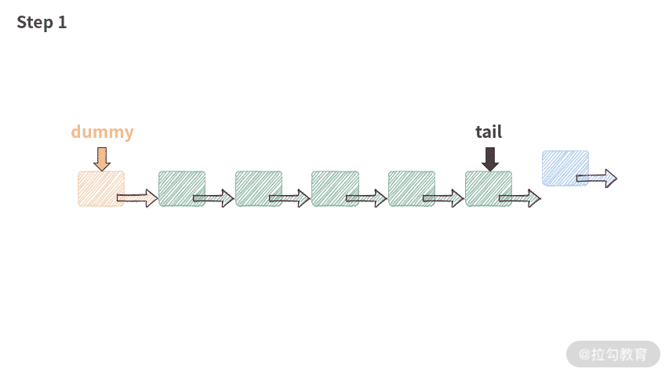
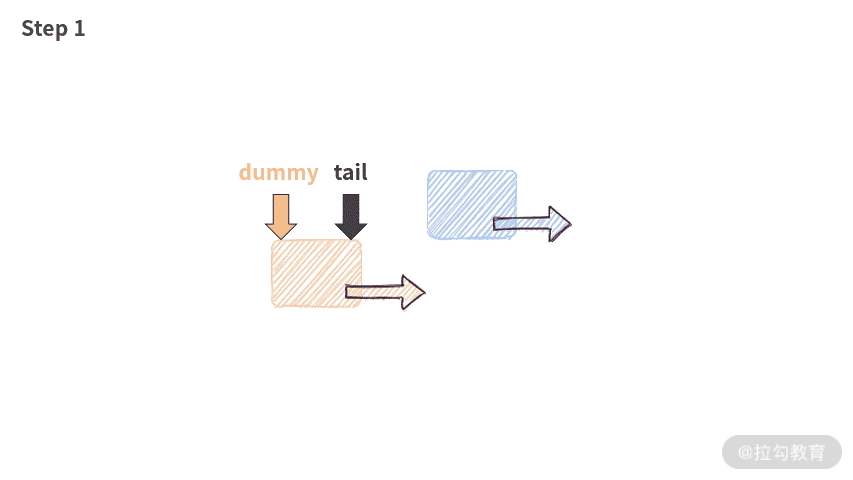
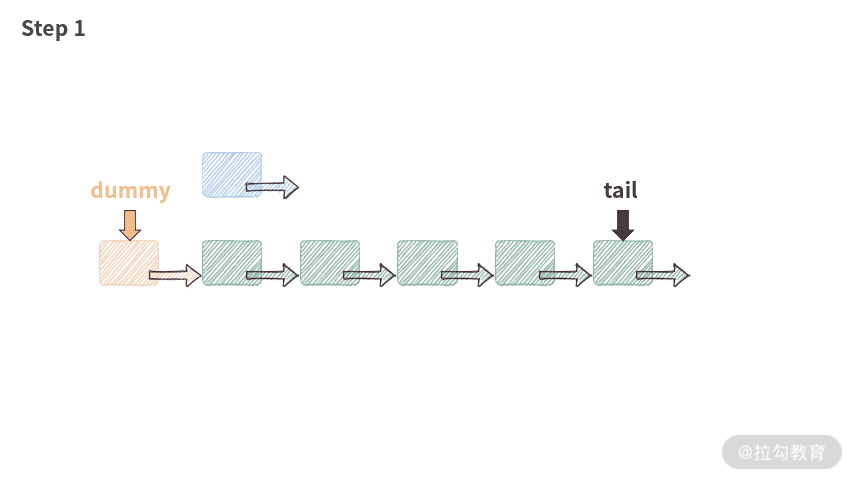
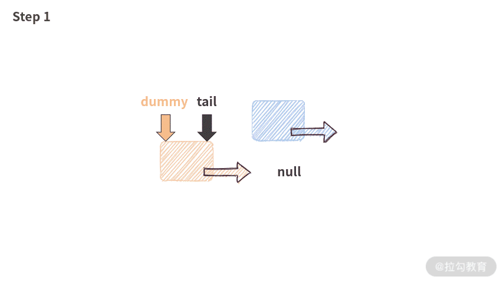
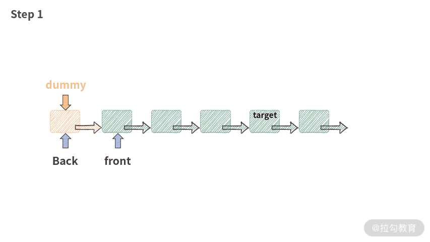
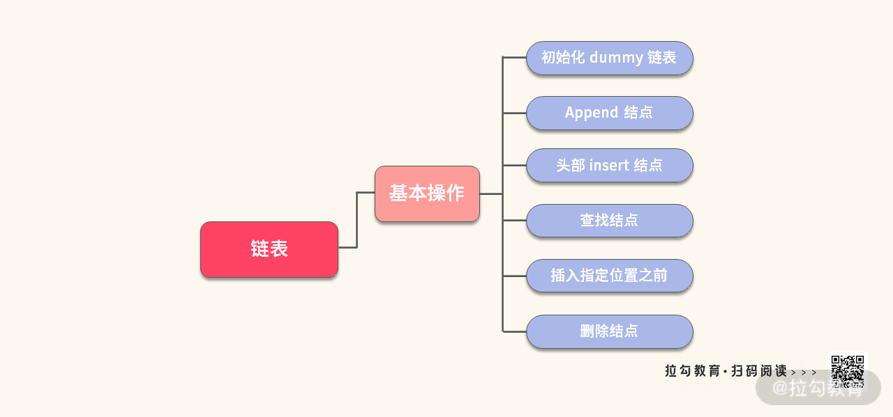

大家都知道程咬金的“三板斧”这个绝技，那今天我也给你介绍解决链表问题的“三板斧”：**假头、新链表、双指针**。由于内容比较多，所以这里拆分了上、下两篇来讲解，通过这一讲的学习，你可以深入理解带假头链表的 6 种最基本的操作。

链表作为一种重要的数据结构，无论是在工作中，还是在面试中都经常出现。这种数据结构可以用在很多地方，比如内核的消息队列、缓存管理、跳表，B+ 树等。

有的面试官非常喜欢考察面试者的链表知识，主要有以下 3 个原因：

1. 操作链表需要非常小心，考虑各种边界情况；
2. 链表结构简单，但是查找、交换、翻转都非常容易出错；
3. 解决链表问题，需要有一定的算法思想，但是又并不太难。在面试过程中，需要你想到解题方法并实现出来，更加考察应试者的工程能力。

> 注：由于链表题的求解重点不在思路，所以这里，我们不再采用“四步分析法”找规律来讲解链表。

在本讲我会介绍一些解决链表的新方法与新思路，带你踏上“链表的奇幻之旅”。

### 三板斧中的第一斧：假头

假头通常也叫作 Dummy Head 或者“哑头”。实际上，就是在链表前面，加上一个额外的结点。此时，存放了 N 个数据的带假头的链表，算上假头一共有 N+1 个结点。

额外的结点不会存放有意义的数据。那么它的作用是什么呢？

你可以这样理解，添加假头后，可以省略掉很多空指针的判断，链表的各种操作会变得更加简洁。接下来，我们看一下关于链表的各种操作，今天主要介绍 6 种最基本的操作：

- 初始化
- 追加结点
- 头部插入结点
- 查找结点
- 插入指定位置之前
- 删除结点

为了将这 6 种基本的操作串起来，我想到了一道考察设计链表的面试题，题目要求应试者将这 6 种基本的操作加以实现：注释中的 /code here/ 部分是填写相应的 6 种功能代码。

```java
// 实现单链表
class MyLinkedList {
  // 链表结点的定义
  class ListNode {
    // val用来存放链表中的数据
    public int val = 0;
    // next指向下一个结点
    public ListNode next = null;
    public ListNode() {}
    public ListNode(int x) {
      val = x;
    }
  }
  /** code here: 初始化链表*/
  public MyLinkedList() {
  }
  public void addAtTail(int val) {
    /* code here: 将值为 val 的结点追加到链表尾部*/
  }
  public void addAtHead(int val) {
    /* code here: 插入值val的新结点，使它成为链表的第一个结点*/
  }
  public int get(int index) {
    /* code here: 获取链表中第index个结点的值。如果索引无效，则返回-1。*/
    // index从0开始。
  }
  public void addAtIndex(int index, int val) {
    // code here:
    // 在链表中的第 index 个结点之前添加值为 val  的结点。
    // 1. 如果 index 等于链表的长度，则该结点将附加到链表的末尾。
    // 2. 如果 index 大于链表长度，则不会插入结点。
    // 3. 如果index小于0，则在头
  }
  public void deleteAtIndex(int index) {
    /* code here: 如果索引index有效，则删除链表中的第index个结点。*/
  }
}
```

### 初始化

初始化假头链表，首先，我们需要 new 出一个链表结点，并且让链表的 dummy 和 tail 指针都指向它，代码如下（解析在注释里）：


```java
  /** code here: 初始化链表*/
  // 初始化dummy
  private ListNode dummy = new ListNode();
  // 初始化链表tail指针
  private ListNode tail = dummy;
  // 初始化链表的长度，此时为0
  private int length = 0;
```


代码：Java/C++/Python

初始化完成后，链表已经有了一个结点，但是此时，整个链表中还没有任何数据。因此，在后文中，我们说一个**空链表**的时候，就是指已经初始化好的带假头链表。

相信你已经学会了这几行代码的精髓，下面我要考考你了。

**小测验：一个带假头的链表初始化的时候，哪个指针是空的？**

- A. dummy 指针
- B. tail 指针
- C. dummy 和 tail 指针
- D. dummy.next 指针

**正确答案 D**

dummy.next 指针。因为带假头的链表初始化以后，dummy 和 tail 都是指向了 new 出来的结点，但是这个时候，还没有任何其他结点进来，所以 dummy.next 为空。

虽然 dummy 和 tail 初始化完成之后，都指向同一个结点。但是这两者还有一个有趣的特点，叫“**动静结合**”。

- 静：dummy 指针初始化好以后，永远都是静止的，再也不会动了。
- 动：tail 指针在链表发生变动的时候，就需要移动调整。

接下来，我们再来看看追加结点。

### 追加结点

尾部添加新结点操作只有两步，代码如下（解析在注释里）：

```java
  public void addAtTail(int val) {
    /* code here: 将值为 val 的结点追加到链表尾部*/
    // 尾部添加一个新结点
    tail.next = new ListNode(val);
    // 移动tail指针
    tail = tail.next;
    // 链表长度+1
    length++;
  }
```


代码：[Java](https://github.com/lagoueduCol/Algorithm-Dryad/blob/main/04.LinkedList/DesignLinkedList.java#L62-L67)/[C++](https://github.com/lagoueduCol/Algorithm-Dryad/blob/main/04.LinkedList/707.%E8%AE%BE%E8%AE%A1%E9%93%BE%E8%A1%A8.cpp#L108-L113)/[Python](https://github.com/lagoueduCol/Algorithm-Dryad/blob/main/04.LinkedList/707.%E8%AE%BE%E8%AE%A1%E9%93%BE%E8%A1%A8.py#L68-L72#L98-L101)

这段代码的执行过程如下图所示：



**小测验**：这里 tail 指针需要判断是否为空吗？

- A. 需要

- B. 不需要

**正确答案 B**

带假头的链表初始化之后，可以保证 tail 指针永远非空，因此，也就可以直接去修改 tail.next 指针，省略掉了关于 tail 指针是否为空的判断。比如，空链表追加新结点时执行过程如下动图所示：



### 头部插入结点

需要插入的新结点为 p，插入之后，新结点 p 会成为第一个有意义的数据结点。通过以下 3 步可以完成头部插入：

1. 新结点 p.next 指向 dummy.next；
2. dummy.next 指向 p；
3. 如果原来的 tail 指向 dummy，那么将 tail 指向 p。

对应的代码如下（解析在注释里）：

```java
  public void addAtHead(int val) {
    /* code here: 插入值val的新结点，使它成为链表的第一个结点*/
     // 生成一个结点，存放的值为val
    ListNode p = new ListNode(val);
    // 将p.next指向第一个结点
    p.next = dummy.next;
    // dummy.next指向新结点，使之变成第一个结点
    dummy.next = p;
    // 注意动静结合原则，添加结点时，注意修改tail指针。
    if (tail == dummy) {
      tail = p;
    }
    length++;
  }
```


代码执行流程如下动图所示：



这段代码有趣的地方在于，当链表为空的时候，它依然是可以工作的。因为虽然链表是空的，但是由于有 dummy 结点的存在，代码并不会遇到空指针，此时工作流程如下：



下面请你通过小测验自我检验。

**小测验：**在插入结点的时候，哪一步最容易遗忘？

A. new 一个假头

B. new 一个新结点

C. 修改 next 指针

D. 修改 tail 指针

**正确答案 D**

如果链表添加了结点，或者删除了结点，一定要记得修改 tail 指针。**如果忘了修改，那么就不能正确地获取链表的尾指针，从而错误地访问链表中的数据。**这一点非常重要，无数人在这个坑上翻过车。

### 查找结点

在查找索引值为 index（假设 index 从 0 开始）的结点时，你需要注意，**大多数情况下，返回指定结点前面的一个结点 prev 更加有用。**

好处有以下两个方面：

1. 通过 prev.next 就可以访问到你想要找到的结点，如果没有找到，那么 prev.next 为 null；
2. 通过 prev 可以方便完成后续操作，比如在 target 前面 insert 一个新结点，或者将 target 结点从链表中移出去。

因此，如果要实现 get 函数，我们应该先实现一个 getPrevNode 函数。具体的操作如下（解析在注释里）：

```java
private ListNode getPrevNode(int index) {
  /*返回index结点的前驱结点，如果index不存在，那么返回dummy*/
  // 初始化front与back，分别一前一后
  ListNode front = dummy.next;
  ListNode back = dummy;
  // 在查找的时候，front与back总是一起走
  for (int i = 0; i < index && front != null; i++) {
    back = front;
    front = front.next;
  }
  // 把back做为prev并且返回
  return back;
}
```

程序的执行过程如下：



有了假头的帮助，这段查找代码就非常健壮了，可以处理以下 2 种情况：

1. 如果 target 在链表中不存在，此时 prev 返回链表的最后一个结点；
2. 如果为空链表（空链表指只有一个假头的链表），此时 prev 指向 dummy。也就是说，返回的 prev 指针总是有效的。

借助 getPrevNode 函数，我们就可以写出 get 函数了，代码如下（解析在注释里）：

```java
public int get(int index) {
  // 获取链表中第 index 个结点的值。如果索引无效，则返回-1。
  // index从0开始
  if (index < 0 || index >= length) {
    return -1;
  }
  // 因为getPrevNode总是返回有效的结点，所以可以直接取值。
  return getPrevNode(index).next.val;
}
```

### 插入指定位置之前

插入指定位置的前面，有 4 个需求。

1. 如果 index 大于链表长度，则不会插入结点。
2. 如果 index 等于链表的长度，则该结点将附加到链表的末尾。
3. 如果 index 小于 0，则在头部插入结点。
4. 否则在指定位置前面插入结点。

其中，Case 1~3 较容易处理。可以直接写。重点在于 Case 4。现在你已经有了 getPrevNode() 函数，就可以比较容易地写出 Case 4 的代码，思路如下：

- 使用 getPrevNode() 函数拿到 index 之前的结点 pre；
- 在 pre 的后面添加一个新结点。

以下是具体的 Case 1~4 的操作过程，具体的代码如下（解析在注释里）：

```java
public void addAtIndex(int index, int val) {
  if (index > length) {
    // Case 1.如果 index 大于链表长度，则不会插入结点。
    return;
  } else if (index == length) {
    // Case 2.如果 index 等于链表的长度，则该结点将附加到链表的末尾。
    addAtTail(val);
  } else if (index <= 0) {
    // Case 3. 如果index小于0，则在头部插入结点。
    addAtHead(val);
  } else {
    // Case 4.
    // 得到index之前的结点pre
    ListNode pre = getPrevNode(index);
    // 在pre的后面添加新结点
    ListNode p = new ListNode(val);
    p.next = pre.next;
    pre.next = p;
    // 注意修改长度
    length++;
  }
}
```

注意： 这里有一个新手很容易犯错的地方，我单独给你提取出来：

```
p.next = pre.next;
pre.next = p;
```


你一定要记住，这两行代码的顺序打死也不能换。一旦交换，链表的操作就会出现错误，再也不能正常工作了。此时出错的情况就会变成下图这样：


### 删除结点

删除结点操作是给定要删除的下标 index（下标从 0 开始），删除的情况分 2 种：

1. 如果 index 无效，那么什么也不做；
2. 如果 index 有效，那么将这个结点删除。

上面这 2 种情况中，Case 1 比较容易处理，相对要麻烦一些的是 Case 2。要删除 index 结点，最好是能找到它前面的结点。有了前面的结点，再删除后面的结点就容易多了。不过我们已经有了 getPrevNode 函数，所以操作起来还是很简单的。

以下是具体的操作过程（解析在注释里）：

```java
// 如果索引 index 有效，则删除链表中的第 index 个节点。
public void deleteAtIndex(int index) {
  // Case 1. 如果index无效，那么什么也不做。
  if (index < 0 || index >= length) {
    return;
  }
  // Case 2. 删除index结点
  // step 1. 找到index前面的结点
  ListNode pre = getPrevNode(index);
  // step 2. 如果要删除的是最后一个结点，那么需要更改tail指针
  if (tail == pre.next) {
    tail = pre;
  }
  // step. 3 进行删除操作。并修改链表长度。
  pre.next = pre.next.next;
  length--;
}
```


代码：Java/C++/Python

### 总结与延伸

在本讲，我向你介绍了三板斧中的第一斧：假头，我们一起成功地设计了一个链表类，其中有 6 种基本操作——初始化、追加结点、头部插入结点、查找结点、插入指定位置前面以及删除结点。你可以参考下图：



这 6 种基本操作是学习链表的基本功，更是解决各种链表题基础的基础！你需要非常熟练地掌握！最后，设计链表完整的代码：

代码：Java/C++/Python