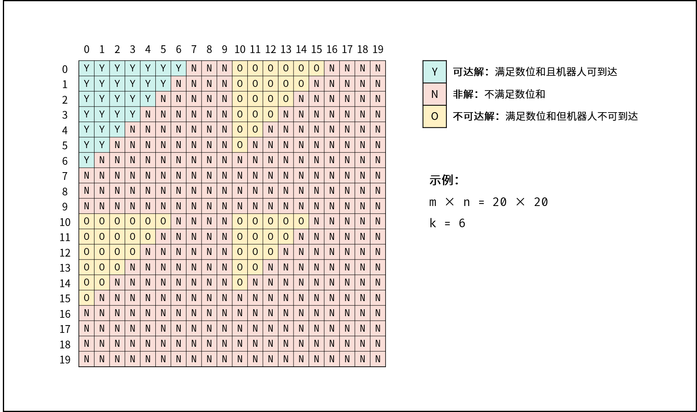
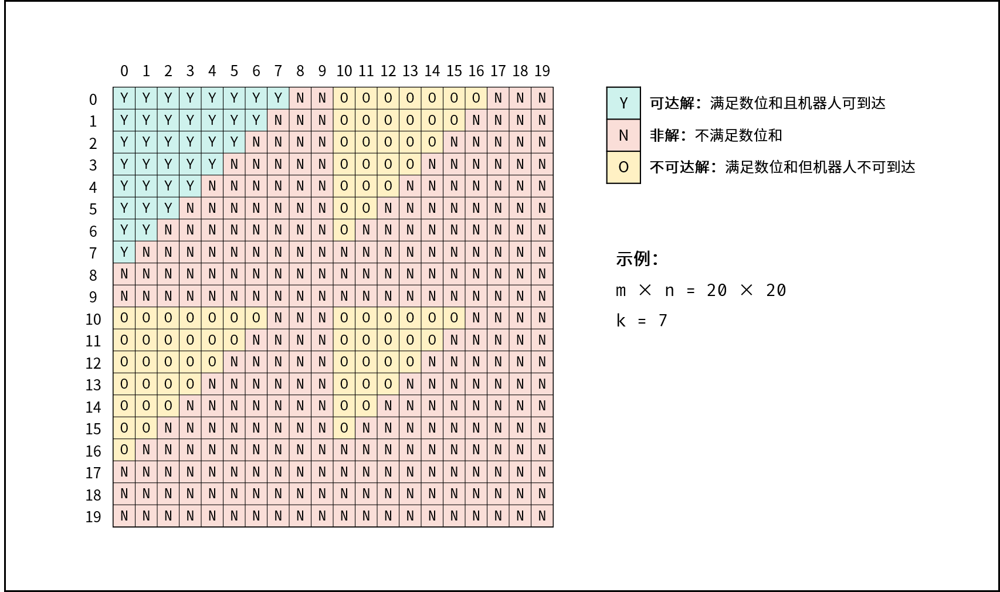
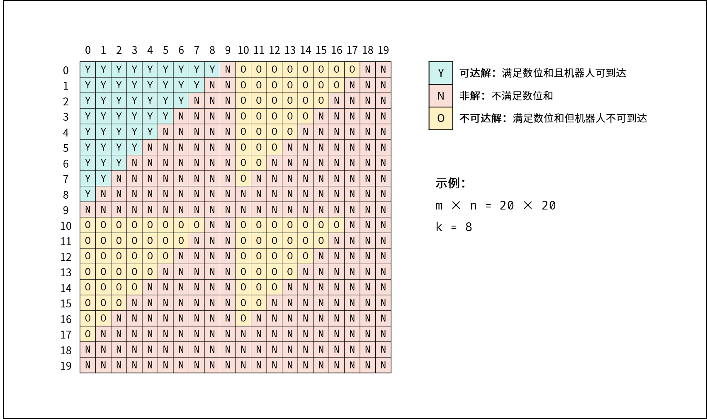
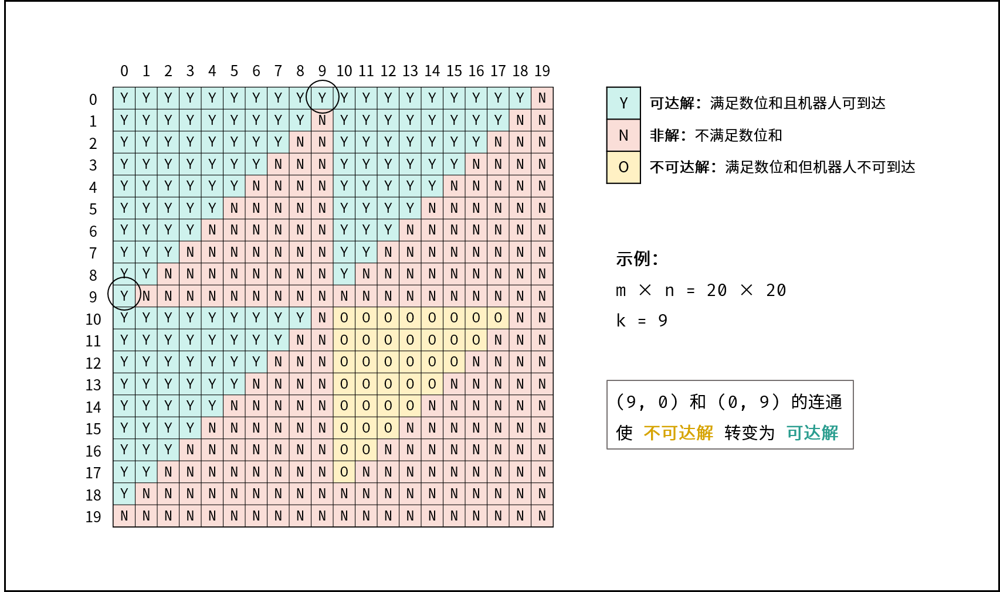
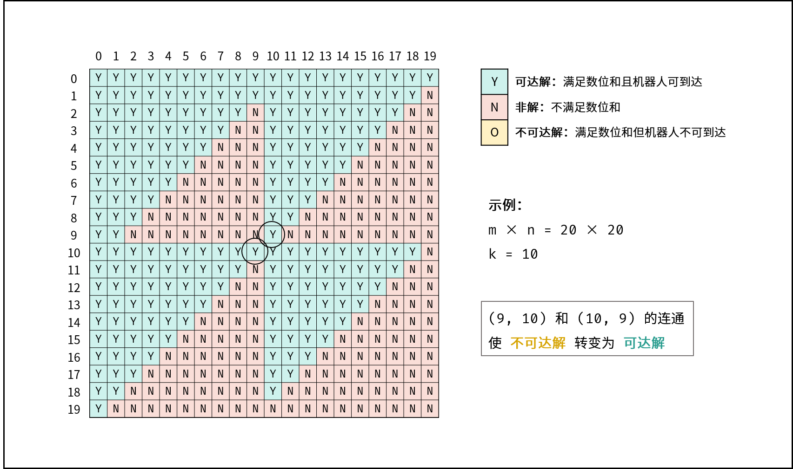
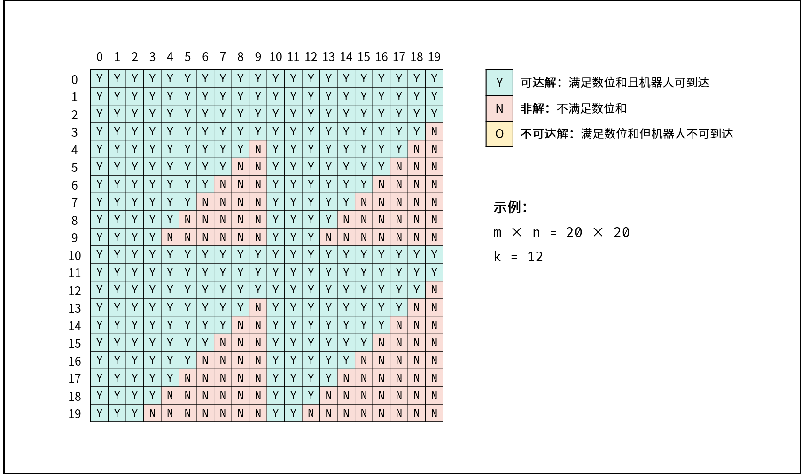
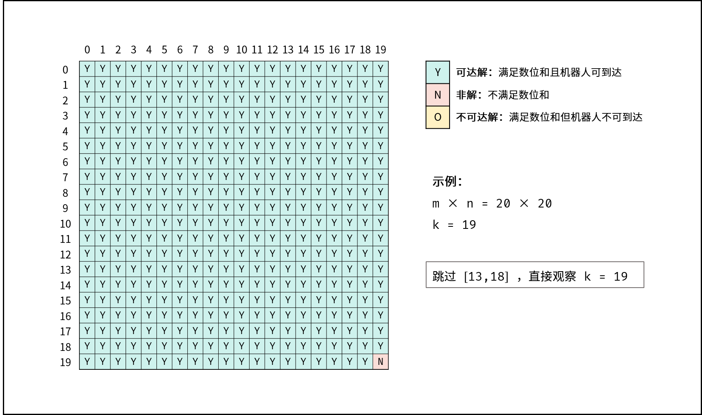

# [剑指 Offer 13. 机器人的运动范围](https://leetcode-cn.com/problems/ji-qi-ren-de-yun-dong-fan-wei-lcof/)

地上有一个m行n列的方格，从坐标 `[0,0]` 到坐标 `[m-1,n-1]` 。一个机器人从坐标 `[0, 0] `的格子开始移动，它每次可以向左、右、上、下移动一格（不能移动到方格外），也不能进入行坐标和列坐标的数位之和大于k的格子。例如，当k为18时，机器人能够进入方格 [35, 37] ，因为3+5+3+7=18。但它不能进入方格 [35, 38]，因为3+5+3+8=19。请问该机器人能够到达多少个格子？

 

**示例 1：**

```
输入：m = 2, n = 3, k = 1
输出：3
```

**示例 2：**

```
输入：m = 3, n = 1, k = 0
输出：1
```

**提示：**

- `1 <= n,m <= 100`
- `0 <= k <= 20`

## 思路

不难看出这道题考察的是遍历

参考[剑指 Offer 13. 机器人的运动范围（ 回溯算法，DFS / BFS ，清晰图解） - 机器人的运动范围 - 力扣（LeetCode） (leetcode-cn.com)](https://leetcode-cn.com/problems/ji-qi-ren-de-yun-dong-fan-wei-lcof/solution/mian-shi-ti-13-ji-qi-ren-de-yun-dong-fan-wei-dfs-b/)

数位之和计算可以使用如下方式

```python
def bitcount(self, num1, num2):
    res = 0
    while num1 != 0 and num2 != 0:
        res += num1 % 10 + num2 % 10
        num1 = num1 // 10
        num2 = num2 // 10
    return res
```

由于机器人每次只能移动一格（从x到x±1），因此每次只需计算x到x±1的**位数**和**增量**。本题1≤*n*,*m*≤100，一下公式仅在此范围使用

数位和增量公式：设x的数位和为$s_x$，$x+1$的数位和为$s_x+1$；

1. 当$(x + 1) \odot 10 = 0$时：$ s_{x+1} = s_x - 8$,例如19,20的数位和分别为10,2；
2. 当$(x + 1) \odot 10 ≠ 0$时，$ s_{x+1} = s_x + 1$，例如1,2的数位和分别为1,2

```python
s_x + 1 if (x+1) % 10 else s_x - 8
```

可达解分析：
根据数位和增量公式得知，数位和每逢 进位 突变一次。根据此特点，矩阵中 满足数位和的解 构成的几何形状形如多个 等腰直角三角形 ，每个三角形的直角顶点位于 0, 10, 20, ...0,10,20,... 等数位和突变的矩阵索引处 。

三角形内的解虽然都满足数位和要求，但由于机器人每步只能走一个单元格，而三角形间不一定是连通的，因此机器人不一定能到达，称之为 不可达解 ；同理，可到达的解称为 可达解 （本题求此解） 。
















根据可达解的结构和连通性，易推出机器人可 仅通过向右和向下移动，访问所有可达解 。

- 三角形内部： 全部连通，易证；
- 两三角形连通处： 若某三角形内的解为可达解，则必与其左边或上边的
- 三角形连通（即相交），即机器人必可从左边或上边走进此三角形。


### 方法一：深度优先遍历BFS

- **深度优先搜索**： 可以理解为暴力法模拟机器人在矩阵中的所有路径。DFS 通过递归，先朝一个方向搜到底，再回溯至上个节点，沿另一个方向搜索，以此类推。
- **剪枝**： 在搜索中，遇到数位和超出目标值、此元素已访问，则应立即返回，称之为`可行性剪枝`。

算法解析：

- **递归参数**： 当前元素在矩阵中的行列索引 `i` 和 `j` ，两者的数位和 `si`, `sj` 。

- **终止条件**： 当 ① 行列索引越界 或 ② 数位和超出目标值 k 或 ③ 当前元素已访问过 时，返回 0 ，代表不计入可达解。

- **递推工作**：
1. **标记当前单元格** ：将索引 `(i, j)` 存入 Set `visited` 中，代表此单元格已被访问过。
  
2. **搜索下一单元格**： 计算当前元素的 **下、右** 两个方向元素的数位和，并开启下层递归 。

- **回溯返回值**： `返回 1 + 右方搜索的可达解总数 + 下方搜索的可达解总数`，代表从本单元格递归搜索的可达解总数。


复杂度分析：
设矩阵行列数分别为 M, N。

时间复杂度 $O(MN)$ ： 最差情况下，机器人遍历矩阵所有单元格，此时时间复杂度为 $O(MN)$。
空间复杂度 $O(MN)$： 最差情况下，Set visited 内存储矩阵所有单元格的索引，使用 $O(MN)$ 的额外空间。

```python
class Solution:
    def movingCount(self, m: int, n: int, k: int) -> int:
        def dfs(i, j, si, sj):
            if i >= m or j >= n or k < si + sj or (i, j) in visited:
                return 0
            visited.add((i, j))
            return 1 + dfs(i + 1, j, si + 1 if (i + 1) % 10 else si - 8, sj) + dfs(i, j + 1, si,
                                                                                   sj + 1 if (j + 1) % 10 else sj - 8)

        visited = set()
        return dfs(0, 0, 0, 0)
```

#### 广度优先遍历

- BFS/DFS ： 两者目标都是遍历整个矩阵，不同点在于搜索顺序不同。DFS 是朝一个方向走到底，再回退，以此类推；BFS 则是按照“平推”的方式向前搜索。
- BFS 实现： 通常利用队列实现广度优先遍历。
  算法解析：
- 初始化： 将机器人初始点 (0, 0)(0,0) 加入队列 queue ；
- 迭代终止条件： queue 为空。代表已遍历完所有可达解。
- 迭代工作：
  1. **单元格出队**： 将队首单元格的 索引、数位和 弹出，作为当前搜索单元格。
  2. **判断是否跳过**： 若 ① 行列索引越界 或 ② 数位和超出目标值 k 或 ③ 当前元素已访问过 时，执行 continue 。
  3. **标记当前单元格** ：将单元格索引 (i, j) 存入 Set visited 中，代表此单元格 已被访问过 。
  4. **单元格入队**： 将当前元素的 下方、右方 单元格的 索引、数位和 加入 queue 。

- 返回值： Set visited 的长度 len(visited) ，即可达解的数量。

> Java/C++ 使用了辅助变量 res 统计可达解数量； Python 直接返回 Set 的元素数 len(visited) 即可。


复杂度分析：

> 设矩阵行列数分别为 M, N 。

时间复杂度 O(MN)： 最差情况下，机器人遍历矩阵所有单元格，此时时间复杂度为 O(MN) 。
空间复杂度 O(MN)： 最差情况下，Set visited 内存储矩阵所有单元格的索引，使用 O(MN)的额外空间。

```python
class Solution:
    def movingCount(self, m: int, n: int, k: int) -> int:
        queue, visited = [(0, 0, 0, 0)], set()
        while queue:
            i, j, si, sj = queue.pop(0)
            if i >= m or j >= n or k < si + sj or (i, j) in visited: continue
            visited.add((i,j))
            queue.append((i + 1, j, si + 1 if (i + 1) % 10 else si - 8, sj))
            queue.append((i, j + 1, si, sj + 1 if (j + 1) % 10 else sj - 8))
        return len(visited)
```